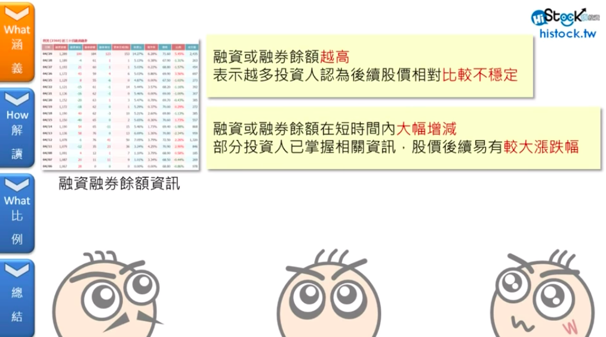

# 基本概念

## 融资融券



## 委比

  
委比＝（委买手数－委卖手数）/\(委买手数＋委卖手数\)×100％  
委比值的变化范围为－100％到＋100％，当委比值为-100％时，它表示只有卖盘而没有买盘，说明[市场](https://link.zhihu.com/?target=http%3A//www.td9999.com/a/hjsc/)的抛盘非常大；  
在A股里当股票封涨停的时候委比为+100%，跌停时委比为-100%。委比在盘中是变动的，如果是从负数变为正数表示买盘变强卖盘变弱，反之则买盘变弱。  
原则上是这样的，但不是绝对的。  
我切个图来说明下儿。如下图，收盘收在当天最高价上，离涨停只有一分钱，有够强吧，但委比呢？还是负的。  
主要看它变动过程，而不是它的绝对值。  
我举个例子如下图所示，这票有分时有够强，但委比的委比是负的。（因为现在不是盘中交易时间我就没办法给你切几个委比数值变化的图了）  
  
再切个图，这票当天走的算是弱的了，但委比值是正的。  
  
以下是我自已对委比这个指标一些理解和看法。  
委比这个指标对于A股里的大多数股票参考作用都不大。  
对一些盘子大的股票有一定的参考作用。对一些主力高度控盘的个股和大多娄小盘股基本没什么意义。之所以这么说是因为真正能拉升和打压股价的单子都不是挂在上面我们可以看见的。以做多的情况为例，当你向上去吃卖一的单的时候，股价就会就会变动，如果你委托在买一以下，股价不会变动。而盘子太大的个股不太容易被控盘，买卖交易散户和机构都比较多，所以盘子越大的个股体现出来数据才会相对客观一些。



